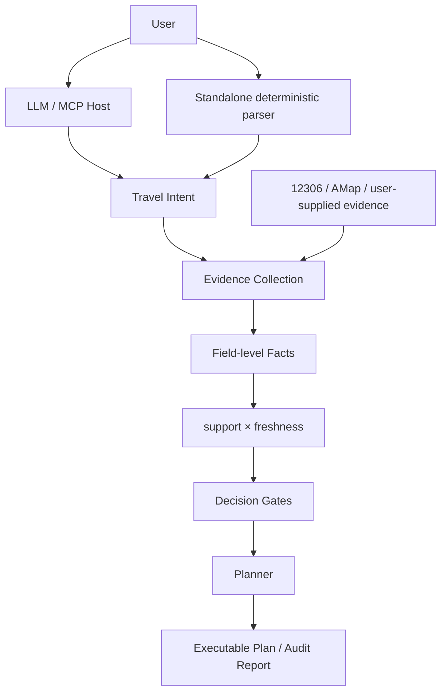

# trip-decider

> **Trip Decider is an evidence-constrained agent for real-world travel decisions.**
>
> 一个先核验现实事实、再决定哪些内容可以进入行程的旅行决策 Agent。

[](https://github.com/Hugin-Z/trip-decider/actions/workflows/ci.yml)

它不把模型记忆当作交通事实，也不生成“看起来合理”的攻略来填空：

- 用 12306 核验铁路车次、时刻与票价；
- 用高德核验地点身份、POI、路线与当地交通；
- 把事实逐字段记录为 `sourced / estimated / conflicting / unknown`，并在读取时计算新鲜度；
- 产出可执行行程，也能审计其他 AI、攻略或人工排出的行程。

模型或 MCP 宿主可以理解需求、调用工具和推进任务，**但模型不是事实来源**。

> Unknown stays unknown. Conflicts stay visible. Freshness is evaluated at read time.
> **Verification > generation.**

当前版本：`0.1.0` release baseline。

## 一个真实结果

一份外部行程曾声称：G1992 从上饶到武汉，15:35 发车，二等座 ¥340。
trip-decider 在 2026-08-04 20:08–20:09（+08:00）查询 12306 后观测到：

| 断言 | 12306 观测值 | 判定 |
| --- | --- | --- |
| 15:35 发车，¥340 | 15:02 发车，¥202.5 | `conflicting` |

它没有“挑一个更像真的”，而是保留断言与观测值，并指出发车时间相差 33 分钟、
票价相差 ¥137.5。同批另外三条没有查到支持证据，被标为 `unknown`，而不是“错误”。

这是一个历史实查快照，不是今天仍有效的时刻表；现在使用前必须重新查询。完整记录见
[第三方行程 vs 12306 实查](docs/field-reports/verify-2026-08-04-third-party-vs-12306.md)。

普通生成式行程会写“下午前往景区，车程约 1 小时”。trip-decider 要么给出可核验的
交通方式、上下车点、班次、费用与返程边界，要么明确告诉你缺什么、何时重查、向谁确认。

## Current scope

当前完整端到端真实复测主要覆盖**武汉 → 婺源及上饶区域**，包括 Claude Desktop / MCP
宿主调用、真实 12306 核验、高德地点与当地交通采集，以及发布前重复 soak。
这不是全国可用性声明。

当前明确不支持或覆盖不足：

- 航班规划和长途公路尚未形成统一支持路径；
- 酒店实时成交价与库存没有稳定来源；
- 景点开放时间与门票覆盖不完整；
- 天气尚未接入；
- 不提供订票、订房、账户或消费级托管服务；
- runtime persistence formats before v2 are not supported.

更多边界见 [KNOWN_ISSUES.md](KNOWN_ISSUES.md)。

## Architecture in one glance



LLM / MCP Host 只位于意图理解和工具编排路径，不位于 truth-source 路径；Standalone
Web 则通过确定性规则提取明确输入。
权威决策链是：

```text
evidence -> support × freshness -> decision gates -> planner
```

详细模块边界见 [CURRENT_ARCHITECTURE.md](CURRENT_ARCHITECTURE.md)。

## 两个主要能力

### Plan：从需求到可执行行程

系统把模糊需求收敛成结构化 intent，确认后再进行目的地候选发现、铁路查询、地点与
POI 核验、当地交通拼接、预算与返程边界检查。候选目录只能提出“值得查什么”，不能
证明可达；是否进入计划由事实级证据和 decision gates 决定。

计划包含逐日事件、交通段、预算状态、未知项和恢复动作。修改节奏或约束时会生成新
PlanVersion；新版本失败不会覆盖已经安装的可用版本。

### Verify：审计别处排好的行程

把其他 AI、攻略或人工行程中的铁路断言交给 trip-decider，它会逐条给出三档结果：

| 结果 | 含义 |
| --- | --- |
| `sourced` / supported | 当前查询得到的事实与断言一致 |
| `conflicting` | 查到了，但观测值与断言不一致；两边都保留 |
| `unknown` / unsupported | 当前没有找到足够证据，或查询/输入条件不足 |

**Unsupported does not mean false.** 超出预售期、站名不完整、网络失败或当前线路未查到，
都不能被偷换成“这趟车不存在”。

## Why this is different

### 1. Field-level evidence

来源不只贴在整份文档上。车次、发车时间、票价、路线时长、POI 身份等字段分别保留
来源、采集时刻、支持状态与计划依赖；一个字段有据，不会自动替同一段里的其他字段背书。

### 2. Support × Freshness

事实支持度与时效是两条独立轴：

- Support：`sourced`、`estimated`、`conflicting`、`unknown`；
- Freshness：`fresh`、`stale`、`undated`。

Support 随证据保存；freshness 根据 `retrieved_at` 和读取时刻重新计算。昨天可信的班次
不会因为曾经写入磁盘，就永远显示为今天仍可信。完整规则见
[evidence axes](docs/contracts/evidence-axes.md) 与
[freshness policy](docs/contracts/freshness-policy.md)。

### 3. Honest failure

系统区分“已核实不存在”、当前未找到、采集超时、来源冲突、内部错误，以及动作仍在
执行。`blocked` 不是一句模糊失败：读取结果必须给出 recovery / `next_action`，说明
系统会重试、用户需要补什么，或哪个冲突需要选择。

### 4. Stateful agent runtime

这不是一次 `prompt -> answer` 调用。运行过程包含：

```text
intent -> confirmation -> execution -> blocked/completed -> revision
```

任务状态、事件、证据和 PlanVersion 都可恢复；界面只是读取同一份 read model，不拥有
另一套事实或规划状态。

## Evidence example

下面仍使用上面的真实 G1992 核验快照，展示一条事实怎样被消费：

```text
Fact:              G1992 departure_at = 2026-08-14 15:02
Source:            China Railway 12306
Observed support:  sourced
Retrieved:         2026-08-04 20:08–20:09 +08:00
Freshness then:    fresh
Compared claim:    departure_at = 15:35; fare = ¥340
Decision:          conflicting
Decision dependency: external itinerary's return rail leg; refetch before relying on it
```

`Freshness then` 只描述当次读取。今天再打开这条记录，它只是历史证据，不能直接进入新计划。

## 两种运行模式

### MCP / Agent-hosted mode

Claude、Codex 或其他 MCP-capable host 负责理解自然语言、选择工具、跟随 `next_call`
推进 runtime，并把结果解释给用户。trip-decider 负责状态、provider 调用、事实、证据判定、
规划和核验。这是完整的 Agent 使用方式；宿主的语言模型仍然不是 truth source。

MCP 配置见 [使用说明](docs/usage.md)。

### Standalone Web

本地 Web 使用确定性的结构化提取规则读取显式日期、地点、人数、预算和偏好，然后调用
同一套 application/query services 与 read model。它没有隐藏的模型调用。

> **Standalone Web intentionally does not require a model API.**

## Quick start

支持 Python `>=3.11,<3.12`。锁定依赖和一键启动脚本目前在 Windows PowerShell 验证。

```powershell
py -3.11 -m venv .venv
.\.venv\Scripts\python.exe -m pip install --requirement .\requirements-dev.lock
```

启动 standalone Web（真实地点和路线查询需要高德 Web 服务 key）：

```powershell
$env:AMAP_WEB_SERVICE_KEY = "<your-amap-web-service-key>"
.\scripts\run_product.ps1
```

浏览器会打开 <http://127.0.0.1:8765/>。凭据只通过进程环境传入，不要写进仓库、日志或截图。

## Reliability

| 层级 | 作用 | 执行方式 |
| --- | --- | --- |
| Offline CI | 确定性回归；pytest、Ruff、Pyright；不需要凭据 | 每个 PR 和 `main` push |
| Live smoke | 检查当前 12306 / 高德响应能否通过真实采集和动作循环 | 有凭据、有网络时人工执行 |
| Soak | 在真实 provider 时序和数据波动下重复走到明确终态 | 发布门，不进入普通 CI |

仓库已有两次可追溯的 20 轮 soak 记录，两次均为 0 个探针失败；其中终态包含“需要用户
补证据”和“无可行候选”，**不等于 40 轮都生成了计划**。详见
[soak gate report](docs/field-reports/soak-2026-08-05-r8-r9-gate.md)。

完整命令、边界和不过度解读方式见 [docs/verification.md](docs/verification.md)。

## 推荐阅读顺序

1. README（你正在读的这份产品与技术概览）
2. [CURRENT_ARCHITECTURE.md](CURRENT_ARCHITECTURE.md)（当前模块和数据流）
3. [docs/verification.md](docs/verification.md)（离线、live smoke、soak 的边界）
4. [docs/usage.md](docs/usage.md)（Web 与 MCP 使用方式）
5. [docs/contracts/](docs/contracts/)（证据与可靠性契约）

`PLAN.md`、`docs/audit/` 与 `docs/field-reports/` 保留工程决策和实测历史，但不是理解产品
的前置阅读。

## License

[MIT License](LICENSE) · © 2026 [Hugin-Z](https://github.com/Hugin-Z)
